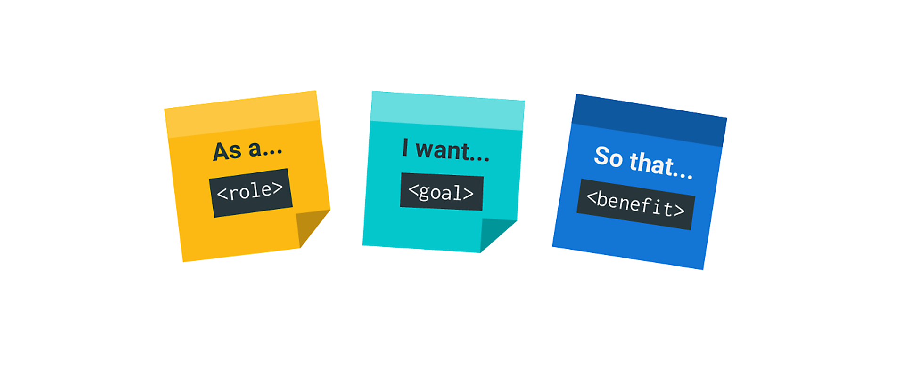
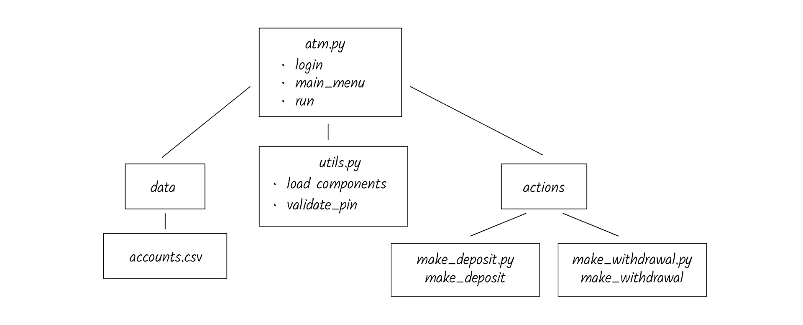

## Module 3.2:  Programming with Functions Part 2

### Overview

In this lesson, students will deepen their understanding of Python functions by learning how to import modules and use built-in Python functions. Additionally, they will explore how to refactor complex algorithms into modular, reusable functions to increase code efficiency and readability. Finally, this session will introduce the concept of creating software applications tailored to business and user needs, providing a real-world context to Python programming. Students will also have the opportunity to write their own Python modules, encouraging creativity and independent problem-solving skills.


### Class Objectives

By the end of today's class, the students will be able to:

* Import and use external Python modules and functions.
* Refactor complex code into functional units.
* Understand how to create software applications based on business and user needs.
* Write and implement their own Python modules.


---

### Instructor Notes

Today’s lesson will focus on importing and using Python functions, a common practice in modular programming. It is important that the students understand these concepts since they’ll be importing modules and functions in the remainder of the course. They’ll also learn how to refactor Python algorithms into functions to improve traceability and readability. Finally, students will learn how to create and use their own Python modules in other programs, based on business and user needs.

Some students may struggle with the pace of class or the Python concepts covered today. Ensure that TAs are circulating and aiding students who need support. If class is ahead of schedule, students may have extra time for additional problems or reviews of class material.


---

### Class Slides

The slides for this lesson can be viewed on Google Drive here: [Module 3.2 Slides](https://docs.google.com/presentation/d/1syJmSd5x6D7Gb9_sgmZPYmCrhgWi9zzSn5Lpq0gLxmw/edit?usp=sharing).

To add the slides to the student-facing repository, download the slides as a PDF by navigating to File, selecting "Download as," and then choosing "PDF document." Then, add the PDF file to your class repository along with other necessary files. You can view instructions for this [here](https://docs.google.com/document/d/1XM90c4s9XjwZHjdUlwEMcv2iXcO_yRGx5p2iLZ3BGNI/edit).

**Note:** Editing access is not available for this document. If you wish to modify the slides, create a copy by navigating to File and selecting "Make a copy...".

---

### Time Tracker

| Start Time | Number | Activity                                           | Duration |
| ---------- | ------ | -------------------------------------------------- | -------- |
| 6:30 PM    | 1      | Instructor Do: Introduction to the Class           | 0:05     |
| 6:35 PM    | 2      | Instructor Do: Importing Modules, Functions, and Methods | 0:15     |
| 6:50 PM    | 3      | Students Do: Importing Car Loan Function           | 0:15     |
| 7:05 PM    | 4      | Review: Importing Car Loan Function                | 0:10     |
| 7:15 PM    | 5      | Instructor Do: Refactoring Code Best Practices     | 0:10     |
| 7:25 PM    | 6      | Everyone Do: Refactoring Travel Loops              | 0:15     |
| 7:40 PM    | 7      | Instructor Do: Working with User Stories and Business Requirements | 0:10     |
| 7:50 PM    | 8      | Groups Do: ATM User Stories                        | 0:10     |
| 8:00 PM    | 9      | Review: ATM User Stories                           | 0:10     |
| 8:10 PM    | 10     | BREAK                                              | 0:15     |
| 8:25 PM    | 11     | Instructor Do: ATM Application Logic               | 0:05     |
| 8:30 PM    | 12     | Students Do: ATM Application Code                  | 0:15     |
| 8:45 PM    | 13     | Review: ATM Application Code                       | 0:05     |
| 8:50 PM    | 14     | Instructor Do: A Modular ATM Design                | 0:10     |
| 9:00 PM    | 15     | Students Do: ATM Modularization                    | 0:15     |
| 9:15 PM    | 16     | Review: ATM Modularization                         | 0:10     |
| 9:25 PM    | 17     | End Class                                          | 0:05     |
| 9:30 PM    |        | END                                                |          |


---

### 1. Instructor Do: Introduction to the Class (5 min)


Open the slideshow and use the first few slides to welcome the class. Cover the following points:

* Welcome the students and explain that, in today’s lesson, they will learn to import modules and functions for Python algorithms. They will also learn to refactor Python scripts into functions and to create and write Python functions based on business and user needs.

---

### 2. Instructor Do: Importing Modules, Functions, and Methods (15 min)

**Corresponding Activity:** [01-Ins_Importing_Modules_Functions_Methods](Activities/01-Ins_Importing_Modules_Functions_Methods/)

Continue using the slideshow to accompany this demonstration.

In this activity, you’ll demonstrate how to import modules, functions, and methods.

#### Modular Programming

Begin by explaining to the students that:

**Modular programming** involves breaking down large, complex programming tasks using smaller “building blocks”, called modules.

* Let the students know that they have used this principle by creating functions.
* Using **modules** of code that suit the needs of the task you are trying to accomplish has many advantages.

#### Advantages of Modular Programming

Next, explain that the advantages of using modules for modular programming are quite similar to what we gain by using functions:

* **Reusability:**
    * Modules are able to be called and used over and over again without the need to duplicate the code.

* **Simplicity & organization:**
    * The use of modules helps to organize otherwise cumbersome code into smaller blocks, each of which accomplishes a specific task. The simplicity makes debugging errors easier too.

* **Maintainability:**
    *It is best practice for programmers to write modules with as few dependencies on other modules as possible, since this reduces the risk that a change to one module will have a knock-on effect on others. This is especially important for teams of programmers collaborating on code.

* **Scoping:**
    * Remember that on Day 1 we discussed scoping. Programmers have to carefully consider which modules will have access to any variables in the code. By using modules, any variables defined inside those modules are only accessible locally, which reduces the risk of naming conflict in the larger program.


#### Importing modules, functions, and methods

Begin by pointing out that, to use modules and the functions they contain, we need to import them into the code where the module is to be used.

Now, go over the following syntax examples on how to import the modules, classes, and functions:

* `import module_name` or  `import file_name`

    * This will import the module or file.

* `from module_name import function_name`, `from file_name import function_name`, or from module_name import method`

    * This will import a function or method from a module or file. If a module has many functions or classes, you can save compute resources by importing the specific function.

    * Note: The `import *` is used to import all the functions or classes from a module. This practice is discouraged as it may use a lot of your computer’s memory. In addition, if you have certain variables and functions with defined namespaces, there may be unknown conflicts with the module’s function and method names.

Next, demonstrate how to import a function from a module:

* The Python `math` module contains many methods and constants that can be used to do mathematical tasks. In the next demo, we will import the `sqrt` function from the `math` module so that we can calculate the square root of a number.

    ```python
    # Import the sqrt function from the math module.
    from math import sqrt

    # Calculate the square root of a number.
    number = 16
    result = sqrt(number)
    print(f"The square root of {number} is {result}")
    ```

* The output from running the code is:

    ```text
    The square root of 16 is 4.0
    ```

Now, demonstrate how to import methods from a module:

```python
# Import the randint and choice methods from the random module.
from random import randint, choice

# Generate a random number between 1 and 10 and select a random element from a list.
random_number = randint(1, 10)
print(f"The random number is: {random_number}")

my_list = ['apple', 'banana', 'orange', 'grape', 'mango']

# Use the choice method to randomly select an element from the list.
random_element = choice(my_list)
print(f"A random element from the list is: {random_element}")
```

The output from running the code is:

```text
The random number is: 9
A random element from the list is: banana
```

Finally, demonstrate how to import classes from a module:

```python
# Import the datetime and date classes from the datetime module.
from datetime import datetime, date

# Get the current datetime using the now function.
current_datetime = datetime.now()
# Get the current time using the strftime function.
current_time = current_datetime.strftime("%H:%M:%S")
# Get the current date using the today function.
current_date = date.today()

print(f"The current datetime is: {current_datetime}")
print(f"The current time is: {current_time}")
print(f"The current date is: {current_date}")
```

The output from running the code is:

```text
The current time is: 2023-07-07 10:57:43.724947
The current time is: 10:57:43
The current date is: 2023-07-07
```

---

### 3. Students Do: Importing Car Loan Function (15 min)

**Corresponding Activity:** [02-Stu_Importing_Car_Loan_Function](Activities/02-Stu_Importing_Car_Loan_Function/)

In this activity, students will import and use a function from a Python file to calculate the future value of a car loan.

After answering any questions that students have about the activity, send out the instructions.

Open the slideshow, and use the next slides as an accompaniment to the activity.

---

### 4. Review: Importing Car Loan Function (10 min)

**Corresponding Activity:** [02-Stu_Importing_Car_Loan_Function](Activities/02-Stu_Importing_Car_Loan_Function/)

Send out the solution file and go over the code with the class, answering any questions students may have about the activity.

Cover the following key points during your discussion:

* First, we import the `calculate_future_value` function from the `CarLoan.py` file.

* Next, we set the function call equal to a variable called `car_value`, then pass the relevant information from the dictionary as parameters to the function call.

* Lastly, we print the future value of the car to two decimal places and thousands.

    ```python
    # Import the calculate_future_value function from the CarLoan file.
    from CarLoan import calculate_future_value

    # Create the new_car_loan dictionary.
    new_car_loan = {
        "current_loan_value": 25000,
        "months_remaining": 12,
        "annual_interest_rate": 0.0315
        }

    # Set the function call equal to a variable called car_value.
    # Pass the relevant information from the dictionary as parameters to the function call.
    car_value = calculate_future_value(
        new_car_loan["current_loan_value"],
        new_car_loan["annual_interest_rate"],
        new_car_loan["months_remaining"]
        )

    # Print the future value of the car to 2 decimal places.
    print(f"The future value of the car is ${car_value: ,.2f}.")
    ```

Answer any questions before moving on.

---

### 5. Instructor Do: Refactoring Code Best Practices (10 min)

**Corresponding Activity:** [03-Ins_Refactoring_Code](Activities/03-Ins_Refactoring_Code/)

Continue using the slideshow to accompany this demonstration.

In this activity, you’ll introduce the concept of refactoring code, why and when to refactor code, and the best practices for refactoring code.

Begin the discussion as follows:

* Programmers and developers of all levels eventually refactor code they have written or someone else's code.

* Refactoring code is an important process in the development of a programmer's career because it not only improves the readability and maintainability of the codebase, but it also fosters a mindset of continuous improvement and encourages the adoption of best practices, leading to more robust, scalable, and efficient software solutions.

#### What is Refactoring?

* It is the process of improving the internal structure of code without changing its external behavior.

* It involves making small changes to the code that enhance its readability, maintainability, and performance, without affecting how the code functions while in use.

* Go over the following example to illustrate **refactoring** code:

    * Initially, you wrote a code that iterates over a list of numbers and multiplies each list element by 0.75 using a `for` loop. But, after yesterday’s lesson, you may realize that you can achieve the same results using a list comprehension — or even a `map` function — and that doing so will allow you to make your code much shorter and neater.

#### Why Refactor Code?

* It improves the design of the software applications.

* The code will be more easily understandable.

* It makes it easier for team members to understand your code and changes you’ve made.

* It broadens your knowledge of the code and its role in the application.

#### Best Practices

Mention to students that these aren’t all the best practices, just some of the main ones.

* Refactoring is not bug fixing. Refactoring should occur after bugs are fixed.
    * However, if part of the code causes unpredictable errors despite trying to fix the problem then refactoring should be considered.

* Make sure to refactor code that is already working and has been tested.
    * See 1 above.
    * If the code has lots of bugs, refactoring may cause more problems.

* Minimize the amount of refactoring.
    * Make small changes and test if the behavior of the code is the same; repeat the process if necessary.

* Avoid adding new features and functionality until you are done refactoring.
     * Refactored code shouldn’t change the behavior of the code

#### Common Examples for Refactoring Python Code

* Some of these examples have been covered in the course thus far, but you may go over them to further illustrate their use for those students who are struggling with the concept.

**Use a list comprehension instead of a `for` loop**

```python
# Code using for loop.
numbers = [1, 2, 3, 4, 5]
squared_numbers = []
for num in numbers:
    squared_numbers.append(num ** 2)

print(squared_numbers)

# Refactored the code to use a list comprehension
numbers = [1, 2, 3, 4, 5]
squared_numbers = [num ** 2 for num in numbers]

print(squared_numbers)
```

**Use the `enumerate()` function instead of the `range()` function**

```python
# Code that uses the range() function.
numbers = [10, 20, 30, 40, 50]
for i in range(len(numbers)):
    print(f"Index: {i}, Value: {numbers[i]}")

# Refactored the code to use enumerate()
numbers = [10, 20, 30, 40, 50]
for i, num in enumerate(numbers):
    print(f"Index: {i}, Value: {num}")
```

**Use a function instead of long code blocks and repetitive tasks**.


```python
# Code without a function.
numbers = [5, 10, 15, 20, 25]
total = 0
count = 0
for num in numbers:
    total += num
    count += 1
average = total / count
print(f"The average is: {average}")

# Refactored code with a function.
def calculate_average(numbers):
    """The function calculates the average of an array of numbers."""
    total = sum(numbers)
    count = len(numbers)
    average = total / count
    return average

numbers = [5, 10, 15, 20, 25]
average = calculate_average(numbers)
print(f"The average is: {average}")
```

If time permits, ask the students the following:
* What do you think we gain from refactoring the code in this way?
* Were there benefits to refactoring this code that outweigh the effort put into refactoring it?

---

### 6. Everyone Do: Refactoring Travel Loops (15 min)

In this activity, students will code along with the instructor who will prompt students at certain points on what the next step in refactoring the example should be. These probing questions combined with the whole group’s participation in the demonstration is meant to reinforce the concept of refactoring.

Students will refactor code by:
* Creating a function that reduces repetition and improves readability.
* Using the `enumerate()` function instead of the `range()` function.

At the end of the activity, inform students that the skill of refactoring code that they’ve just learned will be applicable for the remaining activities, where they’ll learn how to create software applications based on business and user needs. Point out that refactoring code is a core skill that they will take with them on their coding journeys beyond this course, wherever they work on code in teams.

**Corresponding Activity:** [04-Evr_Recfactoring_Travel_Loops](Activities/04-Evr_Recfactoring_Travel_Loops/)

Continue through the slideshow, using the next slides as an accompaniment to this activity.

---

### 7. Instructor Do: Working with User Stories and Business Requirements (10 min)

**Corresponding Activity:** [05-Ins_Working_with_User_Stories](Activities/05-Ins_Working_with_User_Stories/)

Continue using the slideshow to accompany this demonstration.

In this demonstration, you’ll explain how **user stories** work in software development, with a focus on agile methodology.

#### Agile Methodology

First, let students know that, at this point, we’ll switch our focus from Python to the application development process.

Explain **agile methodology**, which is an important part of application development.

  * To improve the speed and quality of the software development process, a style of project management was created that focused on cross-team collaboration and feedback.  These days, agile methodology is commonly used in software development and several other industries.

    * **Note:** You can give an example of an agile methodology practice from your own experience, such as the concept of a daily scrum meeting.

* When following an agile software development process, you’ll often hear the term **user stories**. User stories help to define the requirements or basic features and functionality of a project.

#### User Stories

A **user story** is a short statement that describes how a type of user needs to interact with a feature in a program. We write user stories in plain language. This is so that both the technical and the nontechnical stakeholders in the software development process can understand what the software should be able to do. User stories often adhere to the following three-part template:

* As a **[type of user]**, I want **[some goal]** so that **[some reason]**.

The following image illustrates a  basic template:





Point out to the students that the template can pack in lots of information in a short statement. It tells you who your user is, what they need, and why they need it. Well-written user stories provide a concise way to specify what a program should do.

Highlight the parts of a user story in more depth:

* **As a [type of user]**: This part refers to the role or person who requires the new feature.

* **I want [some goal]**: In this part of the template, you need to express what the user is trying to achieve. This statement should be free of technology implementation details.

* **so that [some reason]**: This part of the template will help you prioritize features by translating the benefit the user wants to achieve into the bigger picture of the problem solved. If you can't write this part for a specific user, the feature might be omitted from the system.

* User stories allow us to express business needs in a way that helps us to implement them into the software.

    * When delivering this code, we can associate the work with a tracked ticket system that many software companies use, like Jira, GitHub Issues, and Asana, to facilitate software development in an agile environment,

* The best way to understand the function of user stories is to create them in the context of a software project.

#### Understanding the Importance of Business and User Needs

Present the following scenario to students:

* Imagine that your manager has asked you to create a new piece of software that converts dollars to Bitcoin. This seems like a simple task that you can embrace using your current Python skill set, right? But, before you start to code, you need to step back and consider the questions that might arise with this task.

* Even a task that seems simple can involve many considerations, which are also known as **business requirements** or **software application requirements**. These requirements specify how to build a program to meet the **business need**—the reason your company is paying you to build the software.

#### Identify Business Needs and Business Requirements

Next, go over business needs and requirements can cover the following:

* Before you begin to develop an application, it's critical that you understand two things.
   * The first is the purpose that it’s intended to serve (the business need).
   * The second is how it should function to properly meet that need (the business requirements).

* To understand the concept of business needs and business requirements, let’s examine your manager’s request more closely:

**Managers request: Create a new piece of software that converts dollars to Bitcoin.**

When thinking about how you’d build a program to do this, you might ask the following questions:

    * What kinds of dollars do I need to consider? A dollar is the official currency in several countries/regions, like the United States, Canada, Australia, Hong Kong, and Singapore.

   * Do I need to get the current dollar-to-Bitcoin conversion or the conversion rate for the last 10 days?

   * What exchange will be my reference?

   * Do I need to offer users the option to buy Bitcoin after computing the conversion rate?

        * **Deep Dive** Writing a business requirements document can take several weeks or even months. This process can slow down software development tremendously. **Agile methodology** was developed specifically to deal with this issue.

Point out that having a thorough understanding of the user stories in the context of the business needs and requirements will help you create the best, most effective solution for the situation at hand.

Explain that, in the next activity, our goal is to read the requirements for an ATM machine and discuss how they would be implemented in code.

---

### 8. Groups Do: ATM User Stories (10 min)

**Corresponding Activity:** [06-Grp_ATM_User_Stories](Activities/06-Grp_ATM_User_Stories/)

In this activity, students will work with a group to analyze a set of user stories in order to plan a Python program that meets user needs.

Break up the class in groups of 3-4 students and have them work on the activity.

---

### 9. Review: ATM User Stories (10 min)

**Corresponding Activity:** [06-Grp_ATM_User_Stories](Activities/06-Grp_ATM_User_Stories/)

Begin by asking each group to share a takeaway from their discussion, such as a challenge they identified in meeting these user requirements or a component of their pseudocode that matches one of the user stories.

After hearing from each group, provide feedback on their approach to the problem, and discuss any questions that they have.

Explain that finance is a heavily regulated industry and that compliance requirements are quite stringent.

Ask the class if they can identify any other features that should be associated with basic ATM functionality. Be sure that at least the following examples are mentioned:

  * Verify that the PIN is valid.

  * Validate that the deposit or withdrawal amount is a positive number.

  * Verify that there are enough funds in the account to cover the withdrawal.

Now that you've identified an approach to designing the program that meets user needs, we can start to convert the specifications into code.

---

### 10. BREAK (15 min)

---


### 11. Instructor Do: ATM Application Logic (5 min)

**Corresponding Activity:** [07-Ins_ATM_Application_Logic](Activities/07-Ins_ATM_Application_Logic/)

Continue using the slideshow to accompany this demonstration.

In this demonstration, you’ll demonstrate how to write code for a simple user story using our ATM user stories.

First, open the [atm_login.py](Activities/07-Ins_ATM_Application_Logic/Unsolved/atm_login.py) file and go over the following:

* Review the `accounts` dictionary in the `atm.py` file.

Next, show students how to create the `login` function. Discuss the requirements that should be met in the code for this function, covering the following points:

* The login function will take in a user PIN as an argument.

* The function should validate the PIN against the provided list of `accounts`.

* If the PIN is validated, the function should return the account's balance.

Convert the requirements into code as follows:

```python
# Define the `login` function for the ATM application.
def login(pin):
    """Create a login function for the ATM application.
    Args:
        pin (integer): The user’s pin number

    Returns:
        If the pin matches one of the pin numbers in the "accounts",
        the account balance is returned.

    Notes:
        Create a for loop to check to validate the PIN against this list of `accounts`.
        If the PIN is validated, print the account's balance formatted to two decimal places and thousandths.
    """
    for account in accounts:
        if int(pin) == account["pin"]:
            print(f"The account balance for PIN {account['pin']} is: ${account['balance']: ,.2f}.")


if __name__ == "__main__":
    # Set the function call equal to a variable called account_balance.
    account_balance = login(246802)
```

With this first user story in place, tell students that they will now implement the remaining functionality of a basic ATM application on their own.

---


### 12. Students Do: ATM Application Code (15 min)


**Corresponding Activity:** [08-Stu_ATM_Application_Code](Activities/08-Stu_ATM_Application_Code/)

In this activity, students will write the business logic and code associated with three ATM functions.

After answering any questions that students have about the activity, send out the instructions.

Open the slideshow, and use the next slides as an accompaniment to the activity.

---

### 13. Review: ATM Application Code (5 min)

**Corresponding Activity:** [08-Stu_ATM_Application_Code](Activities/08-Stu_ATM_Application_Code/)

Review the solution file with students.

* Most students should have drawn basically the same conclusions, though their approaches or features might differ slightly.

Make sure that students' code satisfies the high-level requirements you would expect from an ATM machine, including accepting and validating a PIN and returning the account balance for the account associated with that PIN.

---

### 14. Instructor Do: A Modular ATM Design (10 min)

**Corresponding Activity:** [09-Ins_Modular_ATM_Design](Activities/09-Ins_Modular_ATM_Design/)

Continue using the slideshow to accompany this demonstration.

This next section of the lesson focuses on the concept of modular programming and how it applies to the ATM application. You will work with a more advanced version of the ATM application than the students previously built.

Recap what has been accomplished so far:

    * At this point, we have a working ATM application that was built in alignment with the user stories.

    * If we wanted to develop this application beyond just the basic functionality, we'd need to redesign the codebase to make it more modular.

* **Systems design** is a technique that professional developers and software engineers use to determine the overall architecture, organization, and structure for a codebase. Following systems design techniques improves efficiency, reliability, and maintainability and allows developers to easily scale their systems.

* Applying systems design principles to this ATM application will make the code cleaner, better organized, and easier to maintain.

Encourage the students to suggest ways to make the ATM application more **modular**.

* Modularizing a codebase means to split the code into several files for two main reasons:

   * It's easier to maintain.
   * It allows us to avoid rewriting a particular piece of common logic multiple times.

Ask students the following questions to start the conversation about modularizing the ATM application:

* What is the starting point of the application?

* Can we group some of the code by functionality?

* Is any code shared across the codebase?

If possible, use [Excalidraw](https://excalidraw.com) to live-code the redesign of the ATM application so that it resembles the following image:


  

Next, open up the [atm_modular_design_solution.py](Activities/09-Ins_Modular_ATM_Design/Solved/atm_modular_design_solution.py) file.

Then, working from the diagram, cover the following information while going over the code.

* The starting point of the application is the `run()` function, which directly involves `login()` and `main_menu()`.

* Based on functionality, we appear to have two groups, divided along the following lines:

    * The `make_deposit(account)` and `make_withdrawal(account)` functions are definitely related actions. But it makes sense to keep them separate because their functionality differs slightly.

    * Helper functions like `load_accounts()` and `validate_pin()` could easily be grouped together in either a `Utils` folder or a `utils.py` script.

Ask the students why they think that `check_balance()` was never separated into its own function or why it wouldn't be included in the `actions` folder.

**Answer:** It doesn't require any action or modification to be done on the account. As a function, it’s unlikely to need future development, as it can be handled with a simple print statement.

Explain that, now that the ATM application has been modularized, the key to running the application successfully lies in the **import statements**.

* Python allows a developer to split code into modules, where their functions and variables can then be stored but referenced in other scripts by using import statements.

* **Rewind** Import statements follow this syntax: `from <relative file path> import <function>`.

Based on the following diagram for the ATM application, work with students to write the syntax for importing the `validate_pin(pin)` and `load_accounts()` functions from the `utils.py` script into the main `atm.py` script:

  

  The resulting code should look as follows:

  ```python
  from utils import (
      load_accounts,
      validate_pin
  )
  ```

Based on this code, ask if any student would like to volunteer the syntax for importing the `make_deposit()` function into `atm.py`.

The code should look like the following example:

  ```python
  from actions.make_deposit import make_deposit
  ```

Explain that folder and file structure levels in the relative path are designated by `.` (dots).

Ask students if they have any questions, either about the ATM diagram or the import statements. In the following activity, they'll modularize the ATM application to match the diagram.

---

### 15. Students Do: ATM Modularization (15 min)

**Corresponding Activity:** [10-Stu_ATM_Modularization](Activities/10-Stu_ATM_Modularization/)

In this activity, students will modularize the ATM application so that the codebase matches the following image:

```text
atm
├── actions
│   ├── make_deposit.py
│   └── make_withdrawal.py
├── data
│   └── accounts.csv
├── modular_atm.py
└── utils.py
```

After answering any questions that students have about the activity, send out the instructions.

---

### 16. Review: ATM Modularization (10 min)

**Corresponding Activity:** [10-Stu_ATM_Modularization](Activities/10-Stu_ATM_Modularization/)

Briefly go over the solution with the students.

Then, survey the class to see what kind of challenges students had with the conversion. Answer any questions students have about the exercises. Students often have issues with the module import statements. Refer to the following information to help resolve students’ questions:

* The import statements required in `atm.py`:

  ```python
  from utils import (
      load_accounts,
      validate_pin,
  )

  from actions.make_deposit import make_deposit

  from actions.make_withdrawal import make_withdrawal
  ```

* Another potential issue when modularizing a program could be the relative path for any file import. In this case, the relative path for the `load_accounts()` function to access the `account.csv` file stayed the same, so no change was needed—but that isn't always likely to be the case. See the following example:

  ```python
  csvpath = Path('data/accounts.csv')
  ```
---

### 17. End Class (5 min)

Congratulate students on completing Day 2 of Module 3!

* Today we’ve deepened our understanding of a few key best practices in the programming space.

Mention that students are now able to:
* Import and use external Python modules and functions.
* Refactor complex code into functional units.
* Understand how to create software applications based on business and user needs.
* Write and implement their own Python modules.

Give the following brief overview of the next lesson:

* A lot of what we’ve been focusing on for the past two days is how to steer clear of unwieldy, brute force approaches to coding in favor of best practices that are more elegant and result in a well-organized code.

* The next lesson will continue along this thread of making our code better by diving into the world of object-oriented programming (OOP), a programming paradigm that uses objects and classes to structure and organize code.

---

© 2023 edX Boot Camps LLC. Confidential and Proprietary. All Rights Reserved.
